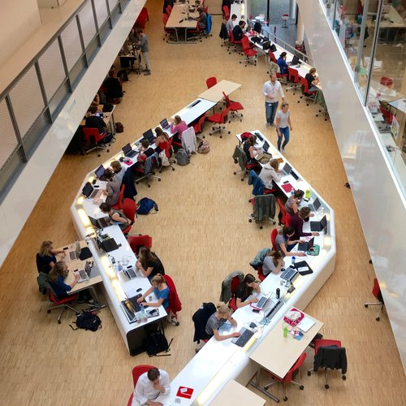
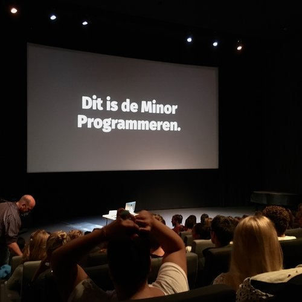
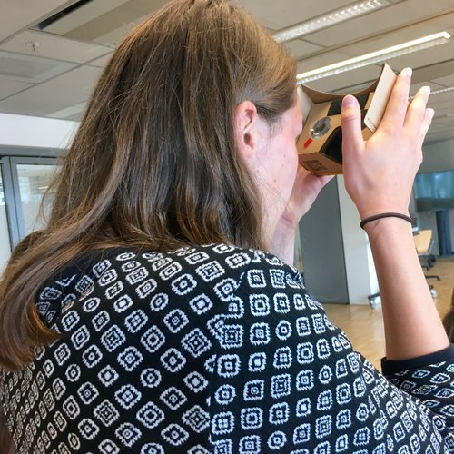
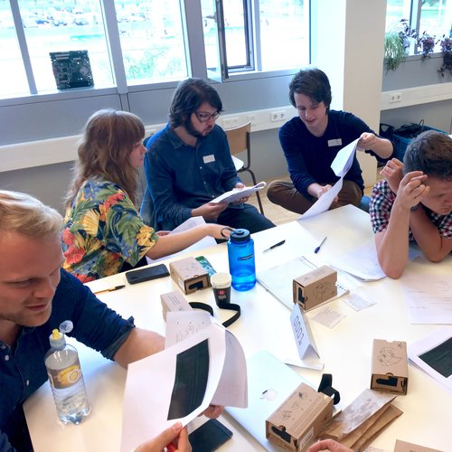
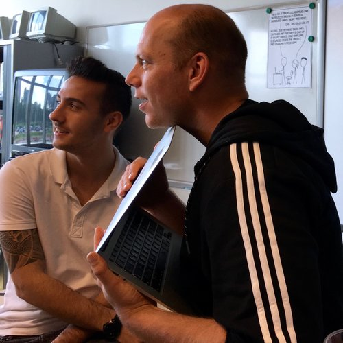
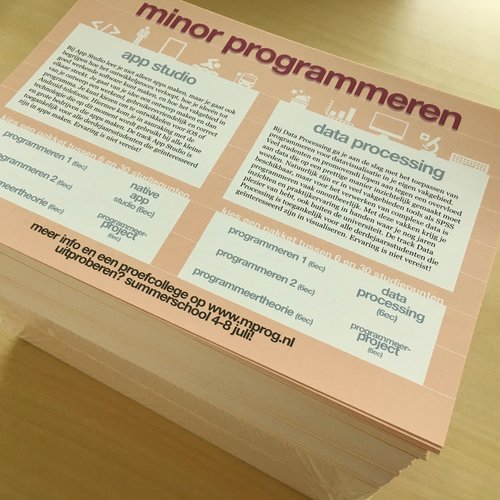
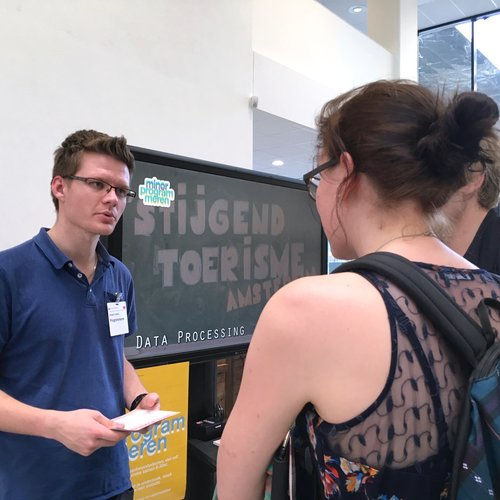
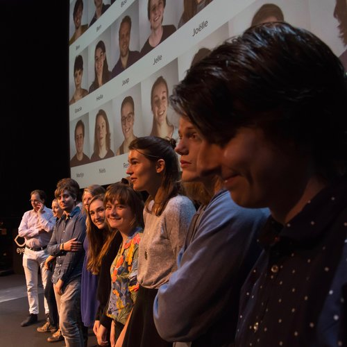

# Welcome

    
    
    
    
    
    
    
    

Dit is het programmeerlaboratorium van de Universiteit van Amsterdam. Een uitdagende omgeving om te leren je eigen tools te maken voor wetenschappelijk onderzoek. Of om web apps te programmeren, zowel de voorkant als de achterkant. Je volgt de beste videocolleges en bent dagelijks aan de slag met het maken van je eigen programma's. Wij bieden je uitstekende begeleiding en een plek waar je je helemaal kan storten op het leren programmeren. Daarna ben je niet alleen een ervaring rijker, maar zul je anders naar computers kijken dan je ooit gedaan had.
